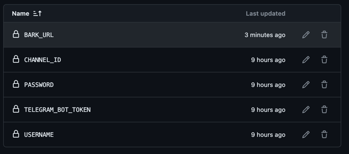
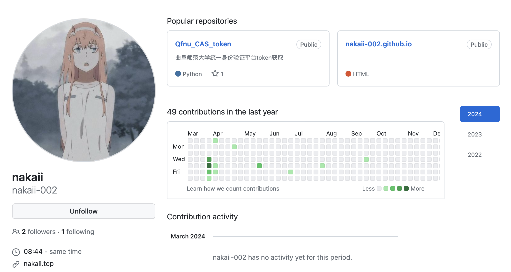

# qfnuLibraryBook

曲Star图书馆预约程序

详细内容请访问我的博客[上杉九月的博客-Wiki-qfnuLibraryBook](https://blog.sakurasep.site/wiki/qfnuLibraryBook/index.html)

## 注意事项

1. 出现在其他设备登录报错信息，请重新获取 auth_token。
2. 本项目目的是告别卡顿的预约界面，采用更快捷的方式自动预约座位。推荐使用云服务器，甚至路由的 openwrt 也可以运行本程序，实现24小时自动监控。
3. 希望预约后能够有效利用如此好的学习环境，这么好的环境不是让某些人谈恋爱和打游戏的，如果你只是去做以上事情，你可以不预约座位，图书馆开放了很多自由活动的空间。
4. 欢迎提出修改建议，请在 issue 中进行交流
5. 本项目仅供交流学习，禁止将本项目用于商业行为

## 环境

Python 3.12.1（Python 3.10+）

macOS Sonoma 14.3

## 使用方法

1. Fork 本项目，修改 `/py/main` 里的 `config.yml`
2. 在 Github 仓库中添加 （必选）USERNAME，PASSWORD (推荐) BARK_URL （可选）CHANNEL_ID TELEGRAM_BOT_TOKEN


### 运行模式

1. 优选模式 仅适用于西校区图书馆的三个自习室，个人优选了有插座的位置。
2. 指定模式 请预先根据 json/seat_info 中各个自习室的真实位置('name')获取座位代号('id')，请输入对应自习室的对应 id
3. 默认模式 全随机预约，速度最快，成功的概率最大
4. 自动签退 2024-03-15 系统关闭了10点后自动签退的功能，目前3次不签退将会被加入黑名单，所以新增了一个自动化签退的模式
5. 重新预约 重新预约当前已经预约的座位

下面是标准的教室名称，请填写标准的教室名称

### 可用教室（仅对于曲阜校区）

#### 西校区图书馆
* 西校区图书馆-三层自习室
* 西校区图书馆-四层自习室
* 西校区图书馆-五层自习室

#### 西校区东辅楼
* 西校区东辅楼-二层自习室
* 西校区东辅楼-三层自习室

#### 东校区图书馆
* 东校区图书馆-三层电子阅览室
* 东校区图书馆-三层自习室01
* 东校区图书馆-三层自习室02
* 东校区图书馆-四层中文现刊室

#### 综合楼
* 综合楼-801自习室
* 综合楼-803自习室
* 综合楼-804自习室
* 综合楼-805自习室 
* 综合楼-806自习室

#### 行政楼
* 行政楼-四层东区自习室
* 行政楼-四层中区自习室
* 行政楼-四层西区自习室

#### 电视台楼
* 电视台楼-二层自习室

**tips: 进程数平常只需要1-2即可，只有压力比较大的时候才需要使用更高的进程数，但是也不需要超过10**
**tips: 请不要在本机网络情况不好的时候使用，虽然报错不影响正常使用，程序的容错已经很不错了，但是我不想再反馈错误日志的时候看到因为网络问题导致的错误**


## 更新日志

> 后续更新日志看 Release

### 2024-03-08 更新
1. 添加了自动获取 token 的代码，代码来自[nakaii-002](https://github.com/nakaii-002)，十分感谢他的代码，使得本项目目前已经实现了全自动化
2. 重构大部分的代码逻辑，大大优化了代码的执行速度和发生错误的概率，不再保存 json 到本地，直接读取响应的内容并进行处理
3. 适配了 aes 加密，今天的版本是最后的开放源代码的版本，后续将会打包加密
4. 程序主要功能已经完善，有问题请提 issue

### 2024-01-08 更新

1. 新增了进程池，如果此时访问url获取请求较为缓慢，请增加进程数以获取更高的响应概率，但是请不要滥用，无端增加服务器压力，推荐进程在5-10最为合适
2. 优化了代码的退出逻辑，基本涵盖了我测试时遇见的场景，是的，做了不少错误处理
3. 优化了代码的可读性，到今天为止该项目基本上就告一段落了，还有一点问题，因为我不会写异步请求，所以用了多进程，可能并发性能不如异步，还有是有些对于json文件的读取并不是十分快速，暂时不优化了

### 2024-01-06 更新

1. 优化目录结构,将获取自习室的信息与抢座功能分离,采用新的执行逻辑
2. 重构大部分代码，增加了可读性，逻辑更加正确

## Todo List

### Features
- [x] Auth_Token的自动获取
- [x] 指定位置预约
- [x] 位置优选
- [x] 多进程获取可用位置
### Bugs
- [x] 修复aes加密导致程序的崩溃
- [x] 优化了部分测试出的错误处理
- [x] 优化代码逻辑

## 贡献者

感谢 [nakaii-002/Qfnu_CAS_token](https://github.com/nakaii-002/Qfnu_CAS_token )提供的获取身份验证 Auth_Token 的代码



## 开源许可协议
本项目是由 @上杉九月 设计和开发，采用了@nakaii-002的部分代码，使用 CC BY-NC 4.0 协议进行授权，拷贝、分享或基于此进行创作时请遵守协议内容：
```
Attribution-NonCommercial 4.0 International (CC BY-NC 4.0)

This is a human-readable summary of (and not a substitute for) the license. You are free to:

Share — copy and redistribute the material in any medium or format
Adapt — remix, transform, and build upon the material

The licensor cannot revoke these freedoms as long as you follow the license terms.
Under the following terms:

Attribution — You must give appropriate credit, provide a link to the license, and indicate if changes were made. You may do so in any reasonable manner, but not in any way that suggests the licensor endorses you or your use.

NonCommercial — You may not use the material for commercial purposes.

No additional restrictions — You may not apply legal terms or technological measures that legally restrict others from doing anything the license permits.

Notices:

You do not have to comply with the license for elements of the material in the public domain or where your use is permitted by an applicable exception or limitation.
No warranties are given. The license may not give you all of the permissions necessary for your intended use. For example, other rights such as publicity, privacy, or moral rights may limit how you use the material.

```
